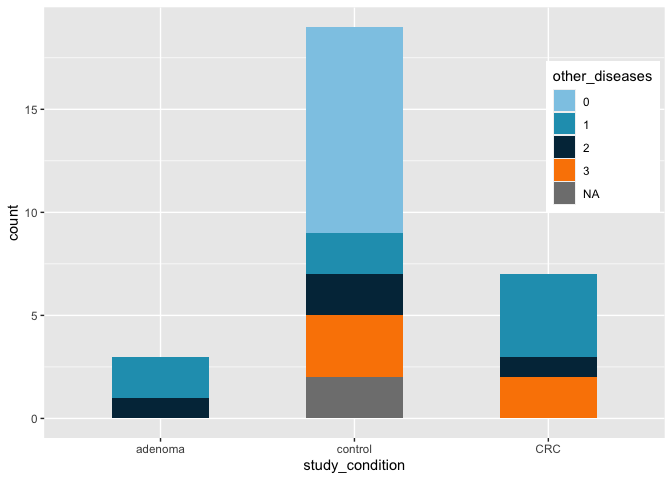
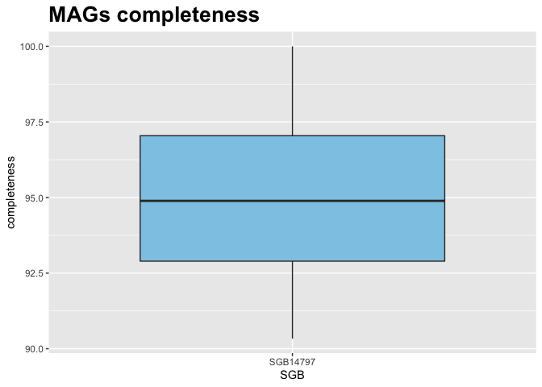
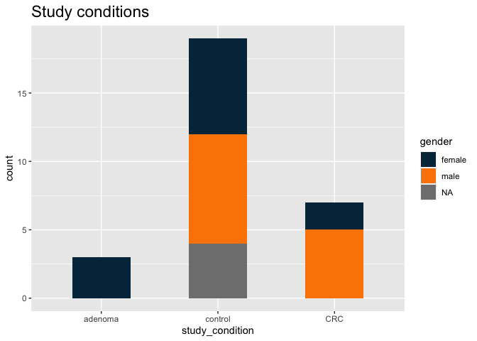
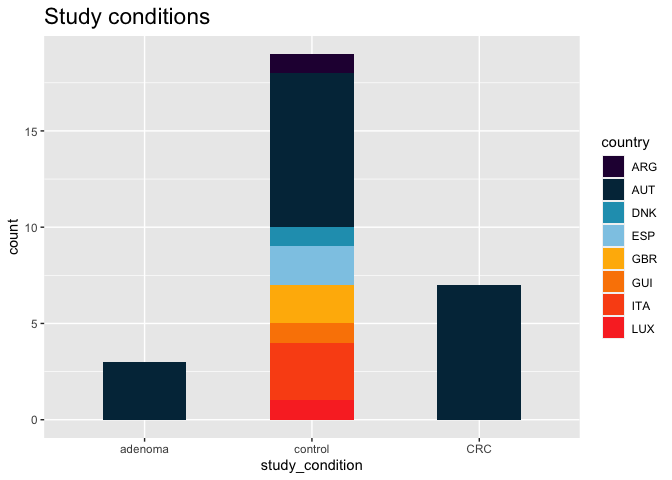
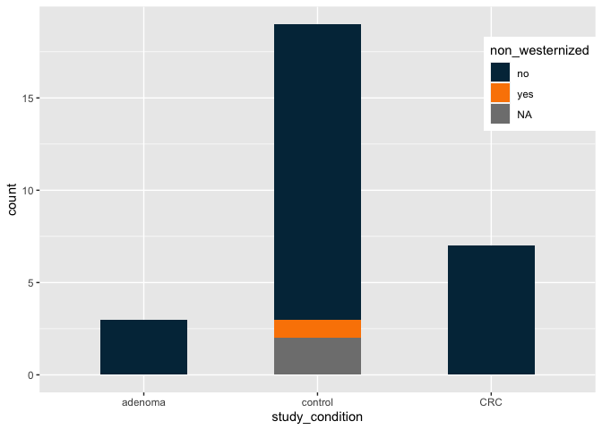
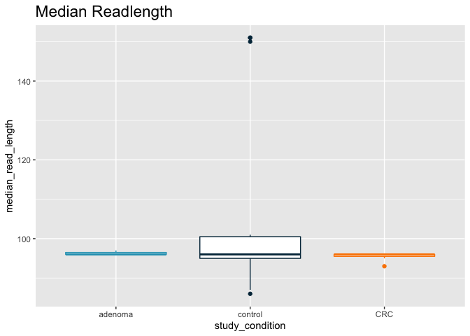

Computational Microbial Genomics - project
================

``` r
# palette
mycolors <- c("#8ecae6", "#219ebc", "#023047", "#ffb703", "#fb8500")

library("ggplot2")
library("rmarkdown")
```

# Overview of the set of MAGs: SGB14797

We are working with 29 MAGs found analysing stool samples and 2
reference genomes from NCBI ( *GCA\_009755265* and *GCA\_011405655* ).

MAGs coming from stool samples are divided in samples coming from
patients diagnosed with colorectal cancer (CRC), adenoma and control
samples. Control samples come from cancer-free patients, but not all of
them are healthy: some suffer from fatty liver, hypertension and/or type
two diabetes (T2D).

``` r
# Load the metadata tsv file
metadata <- read.table("SGB14797_metadata.tsv", sep = "\t", header = 1)

# Load the bin data tsv file
bin_data <- read.table("SGB14797_bin_data.tsv", header=1, sep = "\t")
```

``` r
# Study conditions
conditions <- cbind(metadata[c(5,6)])
conditions["other_disease"] <- "YES"
conditions$other_disease[which(is.na(conditions$disease))] <- NA
conditions$other_disease[which(conditions$disease=="healthy")] <- "NO"
ggplot(data=conditions, aes(x=study_condition, fill=other_disease)) +
  geom_bar(stat = "count", width=0.5) +
  ggtitle("Study conditions")+
  theme(plot.title = element_text(size = 20, face = "bold")) +
  scale_fill_manual(values = mycolors[c(3,5)])

## Some exploratory analysis

# Completeness

ggplot(data=bin_data, aes(x=SGB, y=completeness)) +
  geom_boxplot(fill=mycolors[1]) +
  theme(plot.title = element_text(size = 20, face = "bold")) +
  ggtitle("MAGs completeness")

# Redundancy

ggplot(data=bin_data, aes(x=SGB, y=redundancy)) +
  geom_boxplot(fill=mycolors[4]) +
  theme(plot.title = element_text(size = 20, face = "bold")) +
  ggtitle("MAGs redundancy")

# Median readlength

ggplot(data=metadata, aes(x=study_condition, y=median_read_length, col=study_condition)) +
  geom_boxplot() +
  ggtitle("Median Readlength") +
  theme(plot.title = element_text(size = 20, face = "bold")) +
  scale_color_manual(values = mycolors[c(2,3,5)]) +
  theme(legend.position = "none")

# Number of bases

ggplot(data=metadata, aes(x=study_condition, y=number_bases, col=study_condition)) +
  geom_boxplot() +
  ggtitle("Number of Bases") +
  theme(plot.title = element_text(size = 20, face = "bold")) +
  scale_color_manual(values = mycolors[c(2,3,5)]) +
  theme(legend.position = "none")

# Number of reads

ggplot(data=metadata, aes(x=study_condition, y=number_reads, col=study_condition)) +
  geom_boxplot() +
  ggtitle("Number of Reads") +
  theme(plot.title = element_text(size = 20, face = "bold")) +
  scale_color_manual(values = mycolors[c(2,3,5)]) +
  theme(legend.position = "none")
```



# Taxonomic assignment

``` r
phyl1 <- read.table("phylophlan_fa.tsv", sep = "\t")
# dim(phyl1)
phyl2 <- read.table("phylophlan_fna.tsv", sep = "\t")
# dim(phyl2)

phylophlan <- rbind(phyl1, phyl2)
col2 <- sapply(strsplit(as.character(phylophlan$V2), ":"), `[`, 3)
phylophlan["Kingdom"] <- sapply(strsplit(as.character(col2), "|", fixed = TRUE), `[`, 1)
phylophlan["Phylum"] <- sapply(strsplit(as.character(col2), "|", fixed = TRUE), `[`, 2)
phylophlan["Class"] <- sapply(strsplit(as.character(col2), "|", fixed = TRUE), `[`, 3)
phylophlan["Order"] <- sapply(strsplit(as.character(col2), "|", fixed = TRUE), `[`, 4)
phylophlan["Family"] <- sapply(strsplit(as.character(col2), "|", fixed = TRUE), `[`, 5)
phylophlan["Genus"] <- sapply(strsplit(as.character(col2), "|", fixed = TRUE), `[`, 6)
phylophlan["Species"] <- sapply(strsplit(as.character(col2), "|", fixed = TRUE), `[`, 7)

phylophlan <- phylophlan[-2]
colnames(phylophlan) <- c("MAG", colnames(phylophlan[seq(2,ncol(phylophlan))]))

# Taxonomic assignment of our SGB

print(t(phylophlan[1,seq(2,ncol(phylophlan))]))
```

    ##         1                               
    ## Kingdom "k__Bacteria"                   
    ## Phylum  "p__Actinobacteria"             
    ## Class   "c__Coriobacteriia"             
    ## Order   "o__Eggerthellales"             
    ## Family  "f__Eggerthellaceae"            
    ## Genus   "g__Adlercreutzia"              
    ## Species "s__Adlercreutzia_equolifaciens"

``` r
# The two XieH incomplete MAGs have a different taxonomy

table(phylophlan$Phylum)
```

    ## 
    ## p__Actinobacteria     p__Firmicutes 
    ##                31                 2
