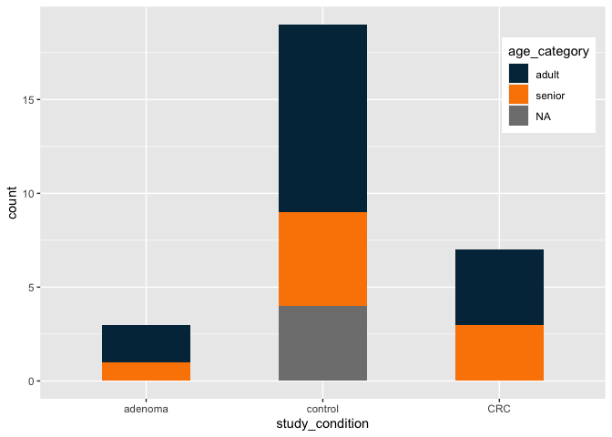
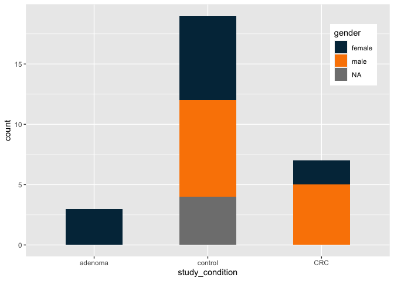
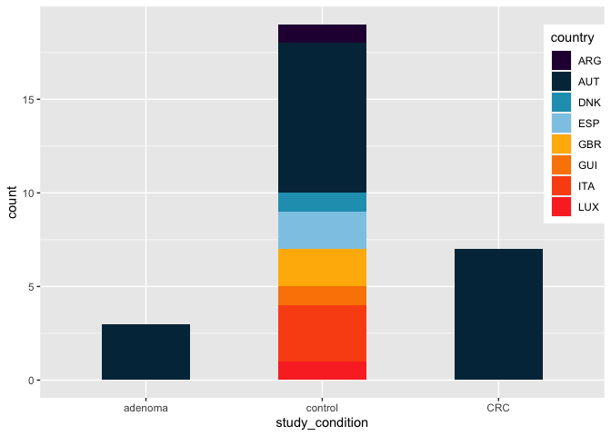
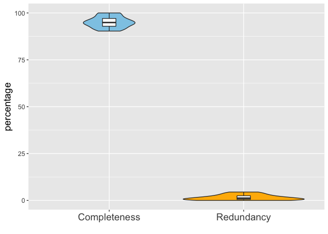
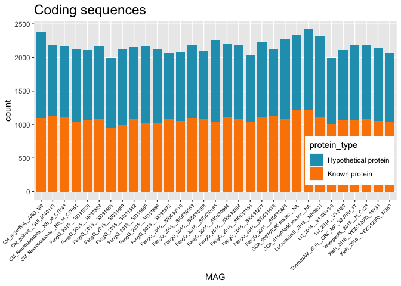

Computational Microbial Genomics - project
================

  - [Overview of the set of MAGs:
    SGB14797](#overview-of-the-set-of-mags-sgb14797)
  - [Taxonomic assignment](#taxonomic-assignment)
  - [Genome annotation](#genome-annotation)

``` r
# palette
mycolors <- c("#8ecae6", "#219ebc", "#023047", "#ffb703", "#fb8500")

library("ggplot2")
library("rmarkdown")
```

# Overview of the set of MAGs: SGB14797

We are working with 29 MAGs found analysing stool samples and 2
reference genomes from NCBI ( *GCA\_009755265* and *GCA\_011405655* ).

MAGs coming from stool samples are divided in samples coming from
patients diagnosed with colorectal cancer (CRC), adenoma and control
samples. Control samples come from cancer-free patients, but not all of
them are healthy: some suffer from fatty liver, hypertension and/or type
two diabetes (T2D).

``` r
# Load the metadata tsv file
metadata <- read.table("CMG_Rscript_data/SGB14797_metadata.tsv", sep = "\t", header = 1, na.strings = c("NA", "N"))

# Load the bin data tsv file
bin_data <- read.table("CMG_Rscript_data/SGB14797_bin_data.tsv", header=1, sep = "\t")
```

``` r
# STUDY CONDITIONS

conditions <- cbind(metadata[c(5,6)])
conditions["other_diseases"] <- 0
conditions$other_diseases[which(is.na(conditions$disease))] <- NA
conditions$other_diseases[which(conditions$disease!="healthy")] <- sapply(strsplit(conditions$disease[which(conditions$disease!="healthy")],
                                                                                  split = ";"), length)
conditions$other_diseases[which(conditions$study_condition!="control")] <- conditions$other_diseases[which(conditions$study_condition!="control")]-1
conditions$other_diseases <- as.factor(conditions$other_diseases)


# health
ggplot(data=conditions, aes(x=study_condition, fill=other_diseases)) +
  geom_bar(stat = "count", width=0.5) +
  theme(plot.title = element_text(size = 17),
        legend.position = c(0.9, 0.7)) +
  scale_fill_manual(values = mycolors[c(1,2,3,5)])

# age
ggplot(data=metadata, aes(x=study_condition, fill=age_category)) +
  geom_bar(stat = "count", width=0.5) +
  theme(plot.title = element_text(size = 17),
        legend.position = c(0.9, 0.8)) +
  scale_fill_manual(values = mycolors[c(3,5)])

# gender
ggplot(data=metadata, aes(x=study_condition, fill=gender)) +
  geom_bar(stat = "count", width=0.5) +
  theme(plot.title = element_text(size = 17),
        legend.position = c(0.9, 0.8)) +
  scale_fill_manual(values = mycolors[c(3,5)])

# country
ggplot(data=metadata, aes(x=study_condition, fill=country)) +
  geom_bar(stat = "count", width=0.5) +
  theme(plot.title = element_text(size = 17),
        legend.position = c(0.95, 0.7)) +
  scale_fill_manual(values = c("#270240", "#023047", "#219ebc", "#8ecae6", 
                               "#ffb703", "#fb8500", "#fa5316", "#fa352a"))

# westernized
ggplot(data=metadata, aes(x=study_condition, fill=non_westernized)) +
  geom_bar(stat = "count", width=0.5) +
  theme(plot.title = element_text(size = 17),
        legend.position = c(0.9, 0.8)) +
  scale_fill_manual(values = mycolors[c(3,5)])

# EXPLORATORY ANALYSIS

# Median readlength
ggplot(data=metadata, aes(x=study_condition, y=median_read_length, col=study_condition)) +
  geom_boxplot() +
  ggtitle("Median Readlength") +
  theme(plot.title = element_text(size = 17),
        legend.position = c(0.9, 0.8)) +
  scale_color_manual(values = mycolors[c(2,3,5)]) +
  theme(legend.position = "none")

# Number of bases
ggplot(data=metadata, aes(x=study_condition, y=number_bases, col=study_condition)) +
  geom_boxplot() +
  ggtitle("Number of Bases") +
  theme(plot.title = element_text(size = 17),
        legend.position = c(0.9, 0.8)) +
  scale_color_manual(values = mycolors[c(2,3,5)]) +
  theme(legend.position = "none")

# Number of reads
ggplot(data=metadata, aes(x=study_condition, y=number_reads, col=study_condition)) +
  geom_boxplot() +
  ggtitle("Number of Reads") +
  theme(plot.title = element_text(size = 17),
        legend.position = c(0.9, 0.8)) +
  scale_color_manual(values = mycolors[c(2,3,5)]) +
  theme(legend.position = "none")
```



``` r
# Completeness and redundancy

cr <- cbind("Completeness", bin_data$completeness)
cr <- rbind(cr, cbind("Redundancy", bin_data$redundancy))
cr <- as.data.frame(cr)
colnames(cr) <- c("SGB14797", "percentage")
cr$percentage <- as.numeric(cr$percentage)

ggplot(data=cr, aes(x=SGB14797, y=percentage, fill=SGB14797)) +
  geom_violin() +
  theme(plot.title = element_text(size = 17),
        legend.position = "none") +
  scale_fill_manual(values = mycolors[c(1,4)]) +
  geom_boxplot(width=0.1, fill="white")
```

<!-- -->

# Taxonomic assignment

All MAGs correctly fall into the same taxonomic assignment, except for
two low quality bins.

``` r
phyl1 <- read.table("CMG_Rscript_data/phylophlan_fa.tsv", sep = "\t")
# dim(phyl1)
phyl2 <- read.table("CMG_Rscript_data/phylophlan_fna.tsv", sep = "\t")
# dim(phyl2)

phylophlan <- rbind(phyl1, phyl2)
col2 <- sapply(strsplit(as.character(phylophlan$V2), ":"), `[`, 3)
phylophlan["Kingdom"] <- sapply(strsplit(as.character(col2), "|", fixed = TRUE), `[`, 1)
phylophlan["Phylum"] <- sapply(strsplit(as.character(col2), "|", fixed = TRUE), `[`, 2)
phylophlan["Class"] <- sapply(strsplit(as.character(col2), "|", fixed = TRUE), `[`, 3)
phylophlan["Order"] <- sapply(strsplit(as.character(col2), "|", fixed = TRUE), `[`, 4)
phylophlan["Family"] <- sapply(strsplit(as.character(col2), "|", fixed = TRUE), `[`, 5)
phylophlan["Genus"] <- sapply(strsplit(as.character(col2), "|", fixed = TRUE), `[`, 6)
phylophlan["Species"] <- sapply(strsplit(as.character(col2), "|", fixed = TRUE), `[`, 7)

phylophlan <- phylophlan[-2]
colnames(phylophlan) <- c("MAG", colnames(phylophlan[seq(2,ncol(phylophlan))]))

# Taxonomic assignment of our SGB

as.data.frame(t(phylophlan[1,seq(2,ncol(phylophlan))]))
```

    ##                                      1
    ## Kingdom                    k__Bacteria
    ## Phylum               p__Actinobacteria
    ## Class                c__Coriobacteriia
    ## Order                o__Eggerthellales
    ## Family              f__Eggerthellaceae
    ## Genus                 g__Adlercreutzia
    ## Species s__Adlercreutzia_equolifaciens

``` r
# The two XieH incomplete MAGs have a different taxonomy

as.data.frame(table(phylophlan$Phylum))
```

    ##                Var1 Freq
    ## 1 p__Actinobacteria   31
    ## 2     p__Firmicutes    2

``` r
# The MAGs with different taxonomy:

phylophlan$MAG[which(phylophlan$Phylum=="p__Firmicutes")]
```

    ## [1] "XieH_2016__YSZC12003_35541__bin.59" "XieH_2016__YSZC12003_36588__bin.73"

# Genome annotation

``` r
# Load prokka tsv files i a dataframe

filenames <- list.files(path = "./CMG_Rscript_data/prokkaTsv/", pattern = ".*.tsv$")

prokka_data <- data.frame()

for (i in seq(1, length(filenames))) {
  title <- paste(strsplit(filenames[i], split="__", fixed=TRUE)[[1]][c(1,2)],collapse="__")
  f <-read.delim(file = paste("./CMG_Rscript_data/prokkaTsv/",filenames[i], sep = ""),
                 header = F, skip = 1, na.strings = "")
  f <- cbind(title,f)
  prokka_data <- rbind(prokka_data, f)
}

colnames(prokka_data) <- c ( "MAG", read.delim(file = paste("./CMG_Rscript_data/prokkaTsv/",filenames[i], sep = ""),
                                               header = F, nrows = 1))

prokka_CDS <- prokka_data[which(prokka_data$ftype=="CDS"),]
prokka_nonCDS <- prokka_data[which(prokka_data$ftype!="CDS"),]

prokka_CDS["protein_type"] <- "Hypothetical protein"
prokka_CDS$protein_type[which(prokka_CDS$product!="hypothetical protein")] <- "Known protein"

dim(prokka_data)
```

    ## [1] 68638     8

``` r
dim(prokka_CDS)
```

    ## [1] 67216     9

``` r
dim(prokka_nonCDS)
```

    ## [1] 1422    8

``` r
# Number of CDS

ggplot(data=prokka_CDS, aes(x=MAG, fill=protein_type)) +
  geom_bar(stat="count", width=0.8) +
  scale_fill_manual(values = mycolors[c(2,5)]) +
  ggtitle("Coding sequences") +
  theme(axis.text.x = element_text(angle=45, hjust=1, vjust=1, size=6, color="black"),
        plot.title = element_text(size = 17))
# non-coding Sequences

ggplot(data=prokka_nonCDS, aes(x=MAG, fill=ftype)) +
  geom_bar(stat="count", width=0.8) +
  scale_fill_manual(values = mycolors[c(3,2,1,4)]) +
  ggtitle("Non-coding Sequences") +
  theme(axis.text.x = element_text(angle=55, hjust=1, vjust=1, size=6, color="black"),
        plot.title = element_text(size = 17))

# Gene length

ggplot(data=prokka_data[which(prokka_CDS$protein_type=="Known protein"),], aes(x=MAG, y=length_bp)) +
  geom_boxplot(fill=mycolors[1]) +
  ggtitle("Gene lengths: known proteins") +
  theme(axis.text.x = element_text(angle=55, hjust=1, vjust=1, size=6, color="black"),
        plot.title = element_text(size = 17))
ggplot(data=prokka_data[which(prokka_CDS$protein_type=="Hypothetical protein"),], aes(x=MAG, y=length_bp)) +
  geom_boxplot(fill=mycolors[5]) +
  ggtitle("Gene lenght: hypothetical proteins") +
  theme(axis.text.x = element_text(angle=55, hjust=1, vjust=1, size=6, color="black"),
        plot.title = element_text(size = 17))
```


